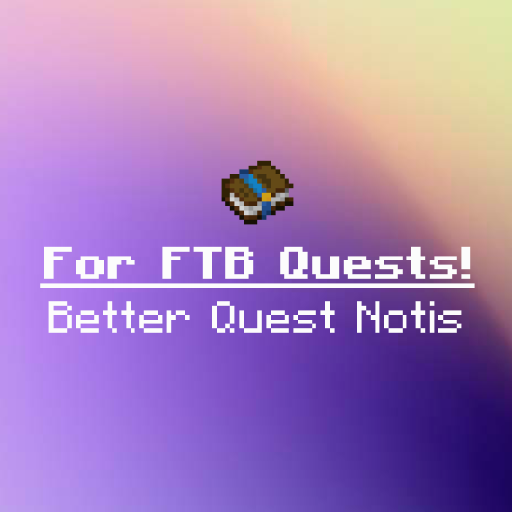

<p align="center">
  
</p>


# Better (FTB) Quest Notifications!

A lightweight FTB Quests addon for Minecraft Forge 1.20.1 that replaces the small corner toast you get on
quest completion with the **Better Questing** popup:

- the quest's icon, center screen
- **`Quest Complete`** in bold, underlined white text
- the quest name underneath
- the level-up sound

## Requirements

- Minecraft 1.20.1
- Forge 47.x
- FTB Quests 2001.4+ (and FTB Library, which it already needs)

Client side only 

## Config

`config/bqn-client.toml`, all client side:

| Section | Key | Default | Notes |
| --- | --- | --- | --- |
| general | `enabled` | `true` | Master switch |
| general | `keepFtbToast` | `false` | Show FTB's corner toast as well as the popup |
| general | `defaultTaskToast` | `true` | Leave single task completions to FTB's corner toast, so the popup is only used for quests, chapters and the whole file |
| general | `useFtbTitles` | `true` | Use "Quest completed!" instead of "Quest Complete" |
| general | `maxQueued` | `20` | Drop the queue past this many, so bulk completions don't spam |
| display | `duration` | `6.0` | Seconds per popup |
| display | `yFraction` | `0.25` | Title position as a fraction of screen height |
| display | `autoScale` | `true` | 1.5x when scaled width > 600 |
| display | `scale` | `1.0` | Flat multiplier, applied at every GUI scale. `1.0` is Better Questing's original size |
| icon | `showIcon` / `iconSize` / `iconOffset` | `true` / `16` / `20` | |
| text | `boldTitle` / `underlineTitle` | `true` / `true` | |
| text | `textShadow` | `false` | Better Questing drew flat text |
| text | `titleColor` / `subtitleColor` | `FFFFFF` | Hex RGB, used only where the text has no colour of its own |
| sound | `playSound` / `sound` / `volume` / `pitch` | `true` / `minecraft:entity.player.levelup` / `1.0` / `1.0` | |

## Previewing

`/bqn [questname] [header] [icon]` fires a 'fake quest' customizable popup

```
/bqn "Slay the Ender Dragon" "Quest Failed" minecraft:dragon_egg 
```

`header` is the line that normally reads `Quest Complete`. `icon` is any item id. Names with spaces need quotes.

Both text arguments are parsed the same way FTB Quests parses a quest title, so you can preview formatting:

```
/bqn "&6&lGolden &r&bQuest" "&#ff00ffQuest Complete"
```

## Formatting

Quest names keep whatever formatting the pack author gave them - `&` codes, `&#RRGGBB` hex colours and raw
JSON components all render as written, and fade in and out with the rest of the popup. `boldTitle` and
`underlineTitle` are applied on top of the header's own formatting rather than replacing it.

## Building

```
./gradlew build
```
